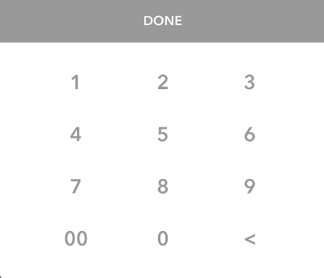

# Ti.MoneyKeyboard [](http://www.appcelerator.com/titanium/) [](http://www.appcelerator.com/alloy/)

Introducing Ti.MoneyKeyboard, an Alloy Widget for doing cross platform dollar amount entry in Titanium.



Developed by [Josh Lambert](http://joshlambert.co), Lead Mobile Developer at [Centreville Tech LLC](http://centrevilletech.com)

### Usage

Create the widget in XML
```xml
<Alloy>
	<Window class="container">
		<Widget src="ti.moneykeyboard" name="widget" id="tiMoneyKeyboard" />
        	<Label text="0.00" id="moneyValueLbl" />
	</Window>
</Alloy>
```

Set the widget up inside of your controller.
```javascript

$.tiMoneyKeyboard.setErrorShakeView($.moneyValueLbl); // Set what we should shake when an error happens.
$.tiMoneyKeyboard.setActiveLabel($.moneyValueLbl); // Set what label we should bind the keyboard to. Must bind before opening/closing the keyboard!

```

## API

### Methods
* `open()` - opens the money keyboard.
* `close()` - closes the money keyboard.
* `setActiveLabel()` - used to bind the keyboard to a label that should update when the user enters a money value.
* `setErrorShakeView()` - used to bind the keyboard to a view it should shake when the user trys to enter a value that's too long.

## Credits

* Hans Knöchel ([@hansemannnn](https://twitter.com/hansemannnn)) for going above and beyond for the Titanium developer community time and time again.
* Jason Kneen ([@jasonkneen](https://twitter.com/jasonkneen)) for producing a lot of great community material, including the [Titanium Talk](https://www.appcelerator.com/blog/2017/08/a-new-podcast-for-titanium-developers/) podcast.
* Fokke Zandbergen ([@FokkeZB](https://twitter.com/FokkeZB)) for tons of useful modules and documentation that helped me learn a lot about Titanium.

## License

    The MIT License (MIT)

    Copyright (c) 2018 Centreville Tech LLC

    Permission is hereby granted, free of charge, to any person obtaining a copy
    of this software and associated documentation files (the "Software"), to deal
    in the Software without restriction, including without limitation the rights
    to use, copy, modify, merge, publish, distribute, sublicense, and/or sell
    copies of the Software, and to permit persons to whom the Software is
    furnished to do so, subject to the following conditions:

    The above copyright notice and this permission notice shall be included in
    all copies or substantial portions of the Software.

    THE SOFTWARE IS PROVIDED "AS IS", WITHOUT WARRANTY OF ANY KIND, EXPRESS OR
    IMPLIED, INCLUDING BUT NOT LIMITED TO THE WARRANTIES OF MERCHANTABILITY,
    FITNESS FOR A PARTICULAR PURPOSE AND NONINFRINGEMENT. IN NO EVENT SHALL THE
    AUTHORS OR COPYRIGHT HOLDERS BE LIABLE FOR ANY CLAIM, DAMAGES OR OTHER
    LIABILITY, WHETHER IN AN ACTION OF CONTRACT, TORT OR OTHERWISE, ARISING FROM,
    OUT OF OR IN CONNECTION WITH THE SOFTWARE OR THE USE OR OTHER DEALINGS IN
    THE SOFTWARE.
